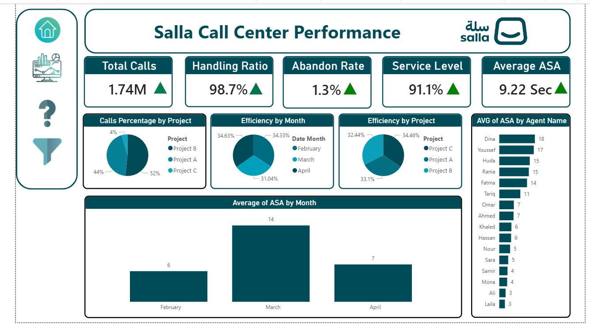

<h1 align="center">📞 Call Center Dashboard | Power BI</h1>

  Interactive Power BI Dashboard for Call Center Performance & Customer Service Analytics

  
  

<h2>📌 Overview</h2>

Interactive dashboard built using Power BI to analyze call center performance and customer service KPIs.

<h2>🛠️ Tools Used</h2>

<ul>
  <li>📊 Power BI</li>
  <li>📁 CSV Dataset</li>
  <li>⚙️ Power Query</li>
  <li>🧮 DAX</li>
  <li>🗂️ Data Modeling</li>
</ul>

<h2>🖼️ Dashboard Preview</h2>

  

  

<h2>📈 Key Insights</h2>

<ul>
  <li>✅ Evaluated call center performance through operational KPIs and service metrics</li>
  <li>✅ Identified high call volume periods to support workforce planning and resource allocation</li>
  <li>✅ Analyzed agent productivity, response efficiency, and customer interaction trends</li>
  <li>✅ Delivered data-driven insights to enhance customer experience and operational performance</li>
</ul>

<h2>🌐 Live Dashboard</h2>

  

<h3 align="center">⭐ If you like this project, give it a star ⭐</h3>
