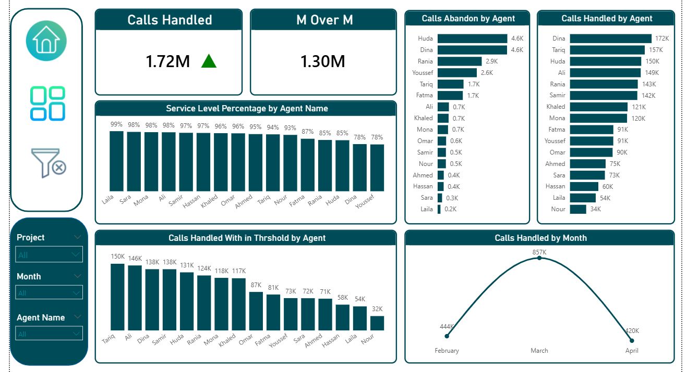

# Call Center Dashboard | Power BI

## Overview
Interactive dashboard built using Power BI to analyze call center performance and customer service KPIs.

---

## Tools Used
- Power BI
- CSV Dataset
- Power Query
- DAX

---

## Dashboard Preview

---

## Key Insights
- Evaluated call center performance through operational KPIs and service metrics
- Identified high call volume periods to support workforce planning and resource allocation
- Analyzed agent productivity, response efficiency, and customer interaction trends
- Delivered data-driven insights to enhance customer experience and operational performance

---

## Live Dashboard
(https://app.powerbi.com/links/Fjq2Kn2imK?ctid=aec2484c-15e6-4c51-84d7-830de7d04ac7&pbi_source=linkShare)
